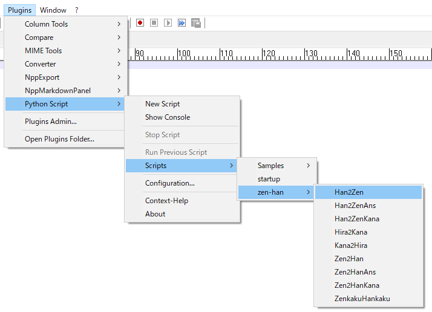

# Full-width ⇔ Half-width
This is a python script to convert Japanese characters for [Notepad++](https://notepad-plus-plus.org/).  

## Main features

* Convert full-width characters to half-width
* Convert half-width characters to full-width
* Convert full-width katakana characters to hiragana
* Convert hiragana characters to full-width katakana

## Installation

* Install the plugin of [Python Script](https://github.com/bruderstein/PythonScript) in [Notepad++](https://npp-user-manual.org/docs/plugins/).
* Copy `zen-han` folder to the scripts' folder. For example:  
  `C:\notepad++\plugins\Config\PythonScript\scripts`

## Usage

1. Select the characters you want to do the convertion.
2. Click the convertion's menu in `Plugins -> Python Script -> Scripts -> zen-han`

## Description of scripts

* Han2Zen  
  `Convert all half-width characters in selection to full-width`
* Han2ZenAns  
  `Convert half-width characters of alphabet, number, sign in selection to full-width`
* Han2ZenKana  
  `Convert half-width characters of katakana in selection to full-width`
* Hira2Kana  
  `Convert hiragana characters in selection to full-width katakana`
* Kana2Hira  
  `Convert full-width katakana characters in selection to hiragana`
* Zen2Han  
  `Convert all full-width characters in selection to half-width`
* Zen2HanAns  
  `Convert full-width characters of alphabet, number, sign in selection to half-width`
* Zen2HanKana  
  `Convert full-width characters of katakana in selection to half-width`
* ZenkakuHankaku  
  `The main library`

## License

This script is available under the
[MIT license](https://opensource.org/licenses/MIT).
